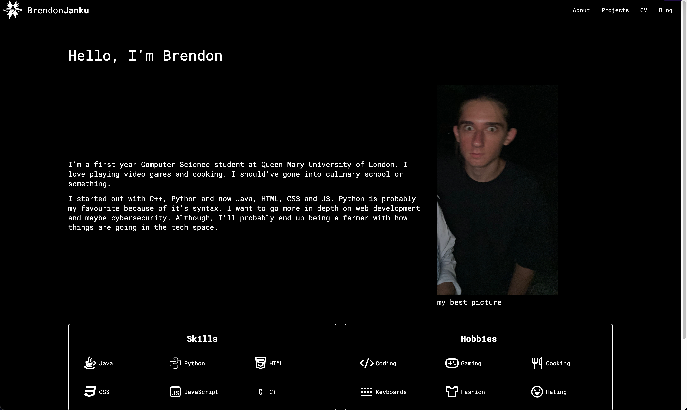

# Personal portofolio website for Web Development module

## Description
This is a personal portofolio website for Web Development module. It is a static website that is built using HTML, CSS, and JavaScript. It is a simple website that is designed to showcase my skills and experience as a web developer.

## Features
- Home page
- About page
- Contact page
- Portfolio page
- Blog page

## Installation
1. Clone the repository
2. Ensure you have PHP installed on your system
3. Navigate to the project directory
4. Open index.php in your web browser

## Usage
This is a personal portofolio website for Web Development module. It is a static website that is built using HTML, CSS, JavaScript, and PHP. It is a simple website that is designed to showcase my skills and experience as a web developer. It has blog functionality that is powered by PHP. The blog posts are stored in a MySQL database.

## Preview

